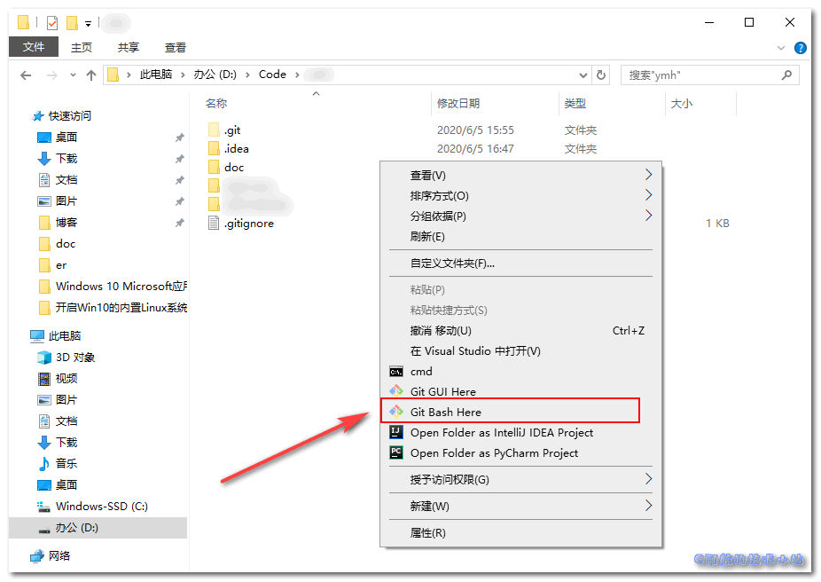
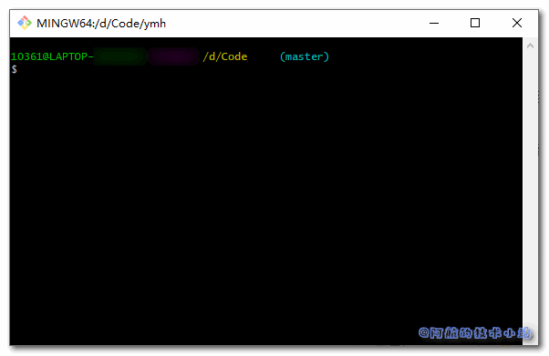
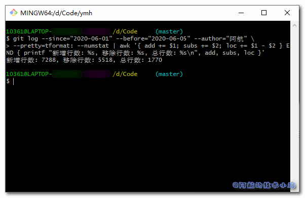

因为要写周工作报告, 自己希望将本周的工作量化出来. 所以想到: "能不能统计一下本周我的代码总行数呢?". 本篇文章就来记录下Git统计代码量、代码行数.

## 应用场景

- 量化工作报告(就像阿航的需求)
- 项目统计
- 小组工作占比统计

## 环境&需具备的条件

本篇博客环境:

| 环境 | 版本 |
| --- | --- |
| 操作系统 | Windows 10 家庭版 |
| Git | 2.25.0.windows.1 |

本篇博客假定你具备以下条件:

1. 计算机已部署git环境
2. 熟悉git基本命令

## 实战开始

本篇教程相当简单. 几步搞定.

### 打开git终端

首先, 进入你的项目目录, 右键打开git bash:



会出现一个比较可爱的窗口:



### 输入统计命令

重点来了! 输入git统计时间段内命令:

\[epcl\_box type="notice"\]这里不能使用Windows的CMD替代git bash进行操作. 会报各种奇葩的错误!\[/epcl\_box\]

```
git log --since="2020-06-01" --before="2020-06-05" --author="阿航" \
--pretty=tformat: --numstat | awk '{ add += $1; subs += $2; loc += $1 - $2 } END { printf "新增行数: %s, 移除行数: %s, 总行数: %s\n", add, subs, loc }'
```

| 参数 | 含义 |
| --- | --- |
| \--since="2020-06-01" | 统计起始日期 |
| \--before="2020-06-05" | 统计结束日期 |
| \--author="阿航" | 需要统计的开发者 |

**将以上参数替换为自己的!**

如果上述信息没有问题, 运行命令. 你会分别看到**新增行数**、**移除行数**以及**总行数**.



\[epcl\_box type="success"\]至此, 我们已经成功实现了我们的功能! \[/epcl\_box\]

## 感谢

[Git 常用命令和统计代码量](https://www.cnblogs.com/east7/p/10237269.html)

## 结语

我们成功的实现了Git统计指定时间日期范围内代码量、代码行数! 快去丰富你的报告吧!
