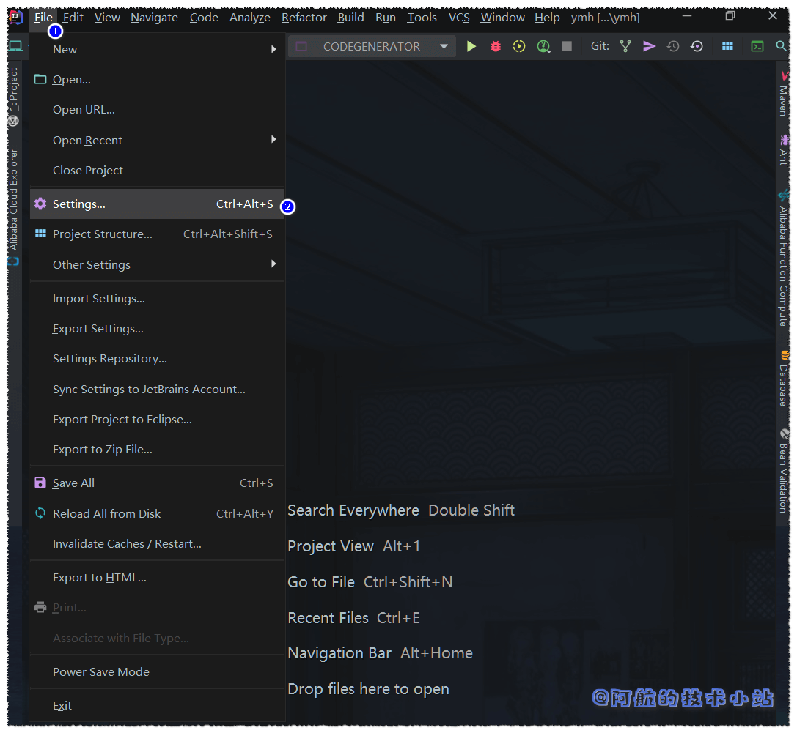

当我们同时维护多个项目时, idea默认的打开最近项目的功能就显得不是那么方便. 我们在这里进行设置, 使我们每次打开idea都可以选择需要打开的项目.

## 打开设置

两种方式:

1. 你可以使用快捷键:  
    Windows: `CTRL` + `ALT` + `S`  
    
2. 点击左上角`File`\->`Settings`

## 进行修改

在设置弹窗中, 找到`Appearance % Behavior`\->`System Settings`\->`Reopen last project on startup`

勾选则是每次打开后默认打开上次项目  
取消勾选则是每次打开后选择项目

## 搞定!
