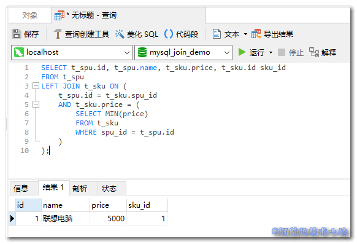
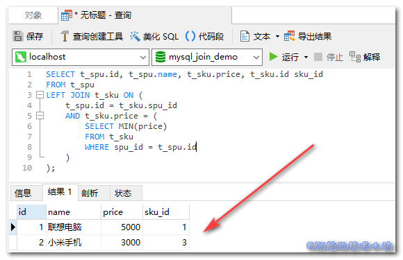

这次阿航在开发后端接口, 写复杂SQL查询时碰到了这个问题, 我需要将MySQL的`JOIN`关键字和`MIN()`同时使用. 本篇文章就来记录下`MySQL` `JOIN` `MIN()/MAX()`的组合使用.

## 应用场景

大家都有过淘宝网购的经历, 应该记得在搜索时, 出来的结果列表都是每个产品的最小价格. 点进去后, 选择不同的型号会有相应的价格.

阿航碰到的是我有两个表, 一个是SPU(产品表), 一个是SKU(商品表), 它们是一对多的关系(因为一款产品会有多个型号). 我需要在查询SPU的同时, 再把对应的最便宜的SKU的价格进行返回.

总结: **一对多关联查询, 并且把多的表的最大/最小值返回.**

## 实战开始

\[epcl\_box type="information"\]为了方便大家理解, 阿航在这里进行相应的简化\[/epcl\_box\]

### 数据关系

先来看下两个表的关系:


> 其中, 一个SPU对应多个SKU ( 比如一件衣服有多个颜色 ).
> 
> 💡 解析

### 初始化数据库

进入数据库, 运行以下SQL语句定义并初始化数据表:

```
CREATE DATABASE mysql_join_demo DEFAULT CHARACTER 
SET = 'utf8mb4';

USE mysql_join_demo;

CREATE TABLE t_spu(
    id BIGINT NOT NULL AUTO_INCREMENT COMMENT '主键',
    name VARCHAR(32) NOT NULL COMMENT '产品名',
    PRIMARY KEY (id)
) COMMENT = '产品SPU表';

CREATE TABLE t_sku(
    id BIGINT NOT NULL AUTO_INCREMENT COMMENT '主键',
    spu_id BIGINT NOT NULL COMMENT '产品ID',
    spec VARCHAR(32) NOT NULL COMMENT '型号',
    price BIGINT NOT NULL COMMENT '价格',
    PRIMARY KEY (id)
) COMMENT = '商品表';

INSERT INTO `mysql_join_demo`.`t_spu`(`id`, `name`) VALUES (1, '联想电脑');
INSERT INTO `mysql_join_demo`.`t_sku`(`id`, `spu_id`, `spec`, `price`) VALUES (1, 1, '低配版', 5000);
INSERT INTO `mysql_join_demo`.`t_sku`(`id`, `spu_id`, `spec`, `price`) VALUES (2, 1, '高配版', 8000);
```

运行完成后, 表的数据结构应该为:

t\_spu(产品表):

| id | name |
| --- | --- |
| 1 | 联想电脑 |

t\_sku(商品表)

| id | spu\_id | spec | price |
| --- | --- | --- | --- |
| 1 | 1 | 低配版 | 5000 |
| 2 | 1 | 高配版 | 8000 |

> 速度快的同学应该发现了, 我们的"联想电脑"分别对应两个型号, 分别为"低配版"以及"高配版"!
> 
> 💡 数据库结构解析

### 定义查询 SQL

我们的目标, 就是**一次查询查到"联想电脑"对应的最便宜的一款型号价格**!

查询语句:

```
SELECT t_spu.id, t_spu.name, t_sku.price, t_sku.id sku_id
FROM t_spu
LEFT JOIN t_sku ON (
    t_spu.id = t_sku.spu_id 
    AND t_sku.price = (
        SELECT MIN(price)
        FROM t_sku
        WHERE spu_id = t_spu.id
    )
);
```

🟢运行, 查看结果:



\[epcl\_box type="success"\]我们成功的查询到了每个产品对应的最便宜商品!\[/epcl\_box\]

## 更多数据

如果想要查看更多产品的效果, 可以添加数据:

```
INSERT INTO `mysql_join_demo`.`t_spu`(`id`, `name`) VALUES (2, '小米手机');
INSERT INTO `mysql_join_demo`.`t_sku`(`id`, `spu_id`, `spec`, `price`) VALUES (3, 2, '小米6', 3000);
INSERT INTO `mysql_join_demo`.`t_sku`(`id`, `spu_id`, `spec`, `price`) VALUES (4, 2, '小米8', 4000);
INSERT INTO `mysql_join_demo`.`t_sku`(`id`, `spu_id`, `spec`, `price`) VALUES (5, 3, '小米10', 4500);
```

🟢运行, 仍然成功:



## 核心代码

```
SELECT 父表.id, 父表.name, 子表.price
FROM 父表
LEFT JOIN 子表 ON (
    父表.id = 子表.spu_id 
    AND 子表.price = (
        SELECT MIN(price)
        FROM 子表
        WHERE spu_id = 父表.id
    )
);
```

> 其中, `price`为需要进行`MIN()`或`MAX()`操作的子表字段

## 感谢

[MySQL Left Join + Min](https://stackoverflow.com/questions/7588142/mysql-left-join-min)
