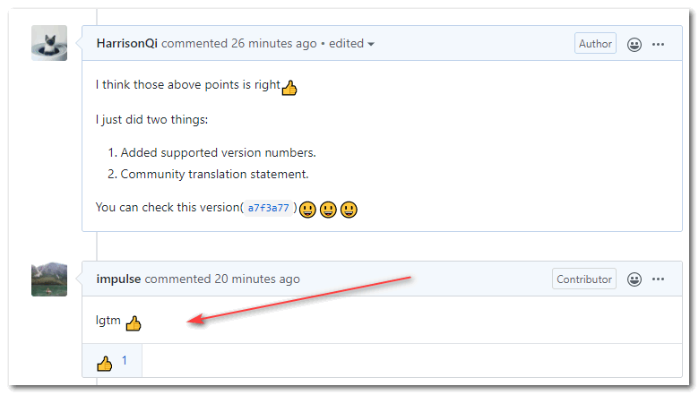

今天阿航在请求合并代码时, 仓库原作者突然回复了一个"LGTM". 一下子给我搞蒙了!😲😲 拼音缩写? 不是! 查词典? 查不到! 后面Google了一下, 看到了最终解释, 茅塞顿开! PR? LGTM? SGTM? 这篇文章来给大家罗列一下Github中老司机的常用缩写!

## 例子

直接举阿航碰到的:

如果你不知道这些缩写, 估计你也会一脸懵逼!

## 缩写&含义

就像"LBWNB"代表"卢本伟牛逼", "现充"代表"现实生活很充实的人生赢家"一样.

如果你不去刻意了解, 是无法从缩写中猜出这些词的真正含义一样. Github的老司机会通过缩写来节省时间或者提高逼格.

| 缩写 | 完整写法 | 含义 |
| --- | --- | --- |
| PR | Pull Request | 拉取请求, 贡献其他项目. |
| LGTM | Looks Good To Me | 已阅, 代码经过review(审查), 可以合并. |
| SGTM | Sounds Good To Me | 和LGTM类似, 也是经过review的意思. |
| WIP | Work In Progress | 已经提上日程了, 属于"部分"PR, 告诉项目维护者功能还未完成, 方便其提前进行部分review |
| PTAL | Please Take A Look | 你来看一下? 提示别人再审查下代码. |
| TBR | To Be Reviewed | 待评审, 用于提示项目维护者进行review. |
| TL;DR | Too Long; Didn't Read | 文字过多, 懒得看. 代码过长, 不便于进行Code review. |
| TBD | To Be Done(or Defined/Discussed/Decided/Determined) | 通常是"没搞定"的意思, 也需要根据语境进行判断. |

## 感谢

- 这篇[PR](https://github.com/flame-engine/flame/pull/350)的[impulse](https://github.com/impulse)发布的评论, 让我了解到这个东西
- [《LGTM? 那些迷之缩写》](https://farer.org/2017/03/01/code-review-acronyms/)
