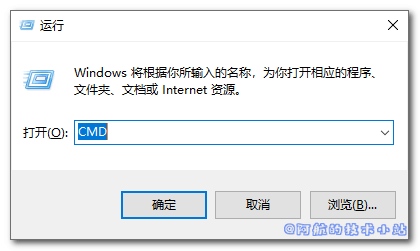
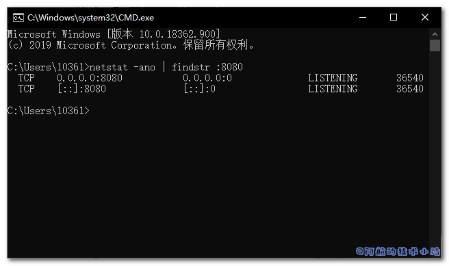
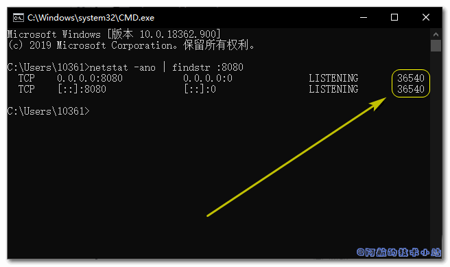
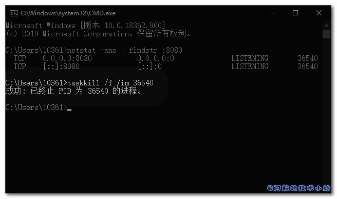

阿航在使用IDEA开发Spring boot项目时, IDEA突然崩溃并闪退. 再次进入时, 提示我端口被占用. 稍微思考了一下, 问题的原因应该是IDE虽然被关闭了, 但是Java进程还在. 所以本篇文章就来记录下Windows如何解除端口占用, 强制关闭/杀死某端口进程.

## 开始

### 打开终端

按下快捷键`Windows`+`R`, 打开运行窗口, 输入`CMD`, 点击回车:

### 找到端口对应ID

打开终端, 输入以下命令(把端口号替换成你的):

    `netstat -ano | findstr :端口号`

如图:

\[epcl\_box type="information"\]可以看到, 如果你有占用的端口, 将会返回一个表格.\[/epcl\_box\]

我们的重点就在最后一列, 记住它. 我们即将通过这个ID来杀死该进程.

### 通过ID杀死进程

接下来我们就要来强制停止, 也就是杀死进程了.

输入以下命令(把进程ID替换为你上面查到的):

    `taskkill /f /im 进程ID`

如果成功, 会返回类似`成功: 已终止 PID 为 .... 的进程`的信息

如图:

搞定.

## 感谢

- [How to close TCP and UDP ports via windows command line](https://stackoverflow.com/questions/8688949/how-to-close-tcp-and-udp-ports-via-windows-command-line)
- [Windows中杀死占用某个端口的进程](https://blog.csdn.net/wangjunjun2008/article/details/9407219)
- 排名不分先后
