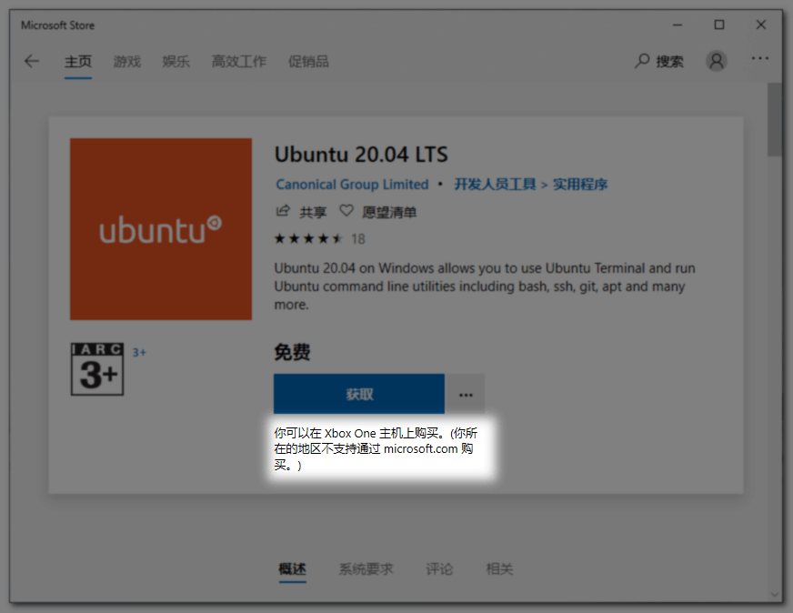
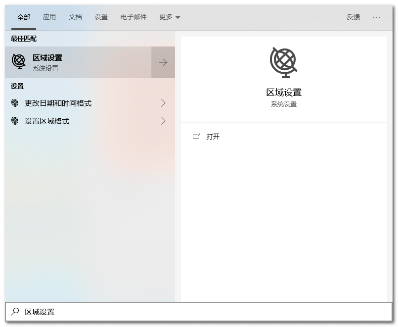
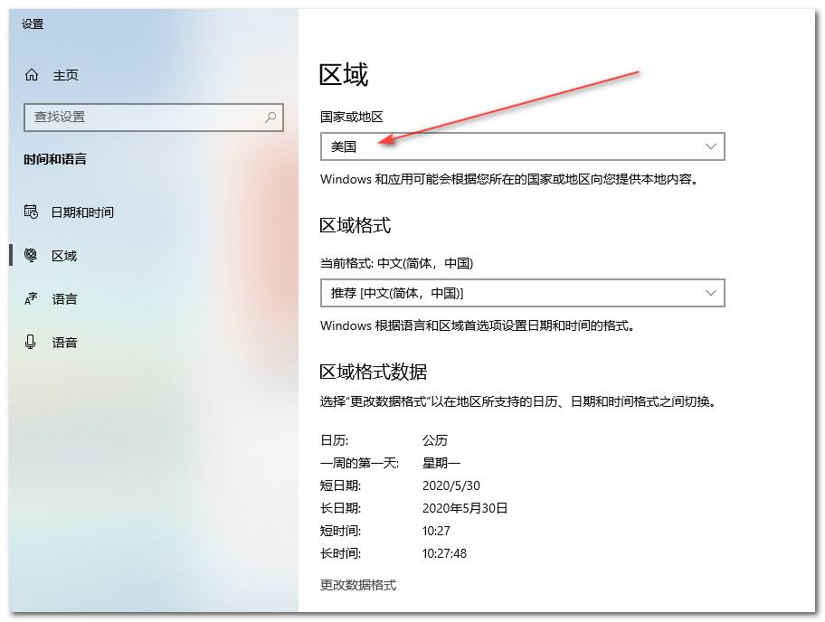
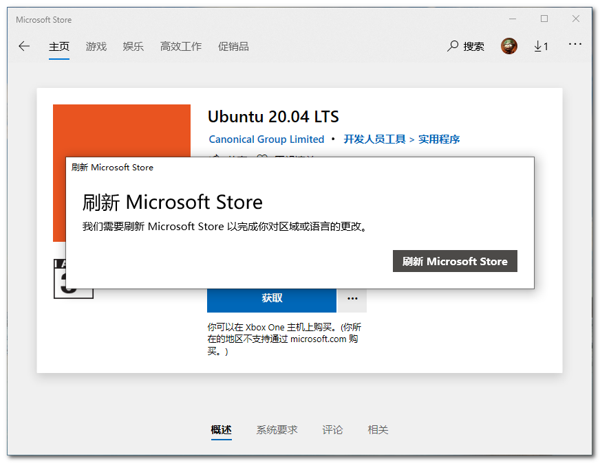
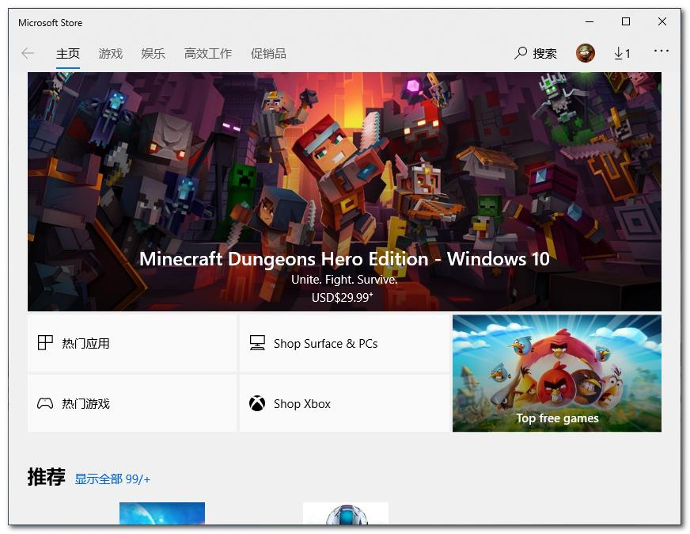

今天在安装Win10应用商店的软件时, 在点击获取时, 很蛋疼的给我提示: `你所在的地区不支持通过 microsoft.com 购买`, 服了. 只能再次填坑. 本篇文章就来记录下如何解决这个坑爹的问题.

## 错误展示

先来看下是在何种情况下出现这种错误的:

去他的吧, 还在Xbox One主机上购买. 用户体验极差🤬🤬🤬🤬

## 解决方案

### 修改系统地区

点击开始, 输入`区域设置`:

点进去, 修改`国家或地区`为`美国`(要不是为了下载软件, 谁会改!):

如果刚才你没有退出Microsoft应用商店, 会弹出如下窗口, 我们点击`刷新 Microsoft Store`:

如果退出了也没关系. 再次进入Microsoft应用商店即可.

刷新后的Microsoft应用商店很明显推送的名称都变成了英文:

再次进入我们要下载的应用页面:

很明显, `获取`按钮下方的naocan提示没有了!

## 其他问题

- 如果点击"获取"按钮无反应, 可以看下[这篇博客](https://www.bugcatt.com/archives/1831).
