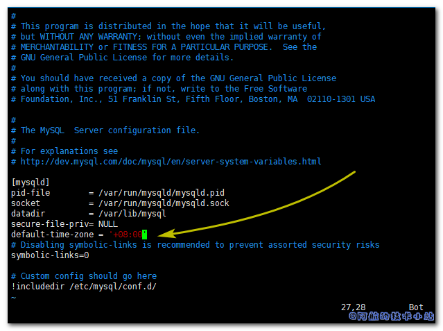

阿航在开发Springboot项目时, 前端告诉验证码一直无效. 本地测试没有问题, 一看远程服务器的数据库时间, 哇塞--早了8小时. 很明显, 是MySQL的时区问题. 本篇文章就来记录下如何修改Docker 的 MySQL 容器时区.

## 解决方案

先来校验下数据库是否真的时区不对. 进入MySQL数据库, 运行语句:

    `SELECT NOW();`

会返回类似这样的数据:

    `mysql> SELECT NOW(); +---------------------+ | NOW()               | +---------------------+ | 2020-07-04 15:46:46 | +---------------------+ 1 row in set (0.09 sec)`

再来查询下当前时区, 输入以下命令:

    `SHOW VARIABLES LIKE '%time_zone%';`

会返回类似这样的数据:

    `mysql> SHOW VARIABLES LIKE '%time_zone%'; +------------------+--------+ | Variable_name    | Value  | +------------------+--------+ | system_time_zone | UTC    | | time_zone        | +00:00 | +------------------+--------+ 2 rows in set (0.12 sec)`

如果返回的时间和你的相差多个小时, 并且时区不对(非+08:00)的话, 那么证明你需要向下看了.

### 方法一: 临时修改

当我们的需求非常急的时候, 我们可以做此临时修改. 运行命令:

    `SET GLOBAL time_zone = '+8:00';`

再次运行以下命令, 校验返回结果是否为当前时间:

    `SELECT NOW();`

返回当前时间则证明修改成功.

\[epcl\_box type="notice"\]之所以本方法称为"临时修改", 是因为重启MySQL后该修改会失效.\[/epcl\_box\]

### 方法二: 启动时加参数

此方法适用于条件允许我们重新创建一个MySQL容器,

创建容器时, 我们需要加上指定时区的命令(东八区是上海, 你可以按需修改为自己的时区):

    `-e TZ=Asia/Shanghai`

所以, 我们的docker完整运行命令应该为(仅供参考, 你的运行命令可能略有差异):

    `docker run -p 3306:3306 --name mymysql -v $PWD/conf:/etc/mysql/conf.d -v $PWD/logs:/logs -e TZ=Asia/Shanghai -v $PWD/data:/var/lib/mysql -e MYSQL_ROOT_PASSWORD=123456 -d mysql:8.0`

要查看各个参数的用途, 请查看我的这篇文章: [《Docker 安装 MySQL》](https://www.bugcatt.com/archives/267).

### 方法三: 修改容器内配置

输入以下命令进入mysql容器:

    `docker exec -it 容器ID bash`

修改MySQL配置文件(两种情况):

    `vim /etc/mysql/mysql.conf.d  或者  vim /etc/mysql/my.cnf`

> 如果以上命令返回`bash: vim: command not found`, 请先阅读[Docker容器没有vim命令的解决方案](https://www.bugcatt.com/archives/2361)

进入配置文件后, 点击`i`进入编辑模式, 添加一行配置文件:

    `default-time-zone = '+08:00'`

如图:

<figure>

<figcaption>

添加配置文件

</figcaption>

</figure>

完成后, 点击`ESC`, 输入`:wq`进行保存并退出.

再输入`exit`退出docker容器.

接下来我们要重启mysql容器, 输入命令:

    `docker restart 容器ID`

\[epcl\_box type="success"\]至此, 已经成功修改了时区配置.\[/epcl\_box\]

重启后, 输入以下命令验证是否成功:

    `SELECT NOW();`

如果返回时间和当前时间一致, 则证明修改成功.

## 结语

如果特别急, 推荐方法一. 不急则推荐方法二. 各位同学按需选择使用.
