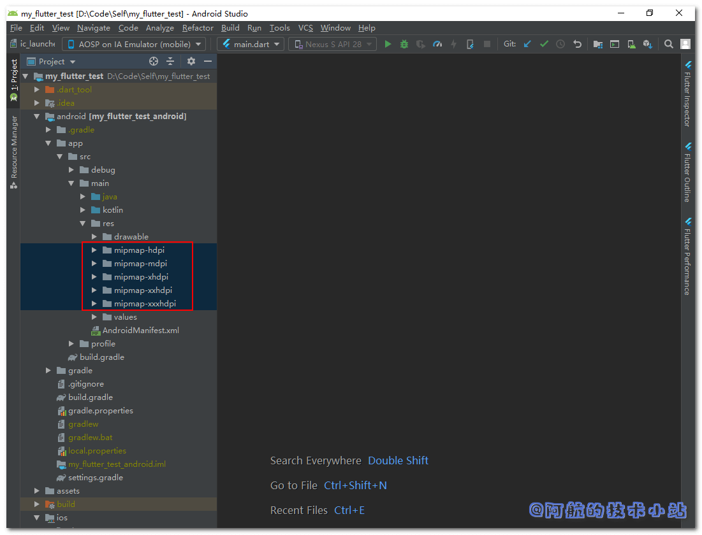

在APP上线前, 我们肯定需要修改APP的启动图标. APP图标代表了它的品牌, 增加了辨识度. 让用户可以在手机的APP列表内快速找到你的APP. 所以本篇博客将记录修改Flutter 的APP图标/启动器图标的全过程.

## Android图标

### 查看初始图标

打开目录`./android/app/src/main/res`, 你会发现有如下几个目录:

```
mipmap-hdpi
mipmap-mdpi
mipmap-xhdpi
mipmap-xxhdpi
mipmap-xxxhdpi
```

如图:



当你打开每个文件, 会发现每个图标都是这张初始图片:


### 图标尺寸规范

我们需要准备以下图片:

| 对应目录 | 尺寸 |
| --- | --- |
| mipmap-mdpi | 48×48 |
| mipmap-hdpi | 72×72 |
| mipmap-xhdpi | 96×96 |
| mipmap-xxhdpi | 144×144 |
| mipmap-xxxhdpi | 192×192 |

### 图标命名规范

它们的文件名通通是`ic_launcher.png`!

### 图标目录结构

目录结构:

```
./android/app/src/main/res/mipmap-mdpi/ic_launcher.png
./android/app/src/main/res/mipmap-hdpi/ic_launcher.png
./android/app/src/main/res/mipmap-xhdpi/ic_launcher.png
./android/app/src/main/res/mipmap-xxhdpi/ic_launcher.png
./android/app/src/main/res/mipmap-xxxhdpi/ic_launcher.png
```

替换完成后, 重新运行你的Flutter项目. 看看你的调试设备的APP启动图标, 你应该就可以看到修改的结果了!

## 感谢

[Pexels](https://www.pexels.com/zh-cn/photo/267389/?utm_content=attributionCopyText&utm_medium=referral&utm_source=pexels) 上的 [Pixabay](https://www.pexels.com/zh-cn/@pixabay?utm_content=attributionCopyText&utm_medium=referral&utm_source=pexels) 拍摄的照片

## 结语

如果你对本篇文章有任何问题, 欢迎在下方评论区, 进行讨论, 或加入[阿航的技术小站交流群](https://jq.qq.com/?_wv=1027&k=egT9rjgu)

欢迎访问[阿航的技术小站](https://www.bugcatt.com)官网, 获取更多技术干货!
