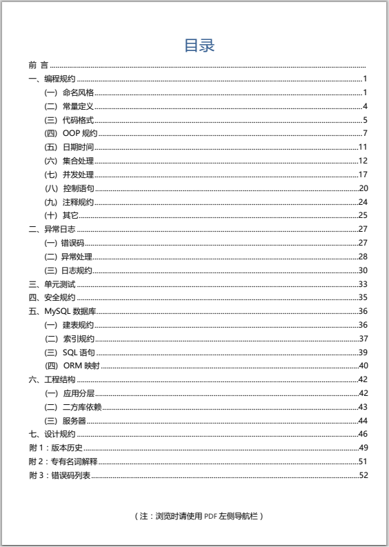

阿里巴巴的Java开发规范系列一直被大多数Java程序员认可并遵循. 这不, 在今天早上8:00, 阿里巴巴再次发布了新版本《Java开发手册泰山版》.

先来看一下封面:

有种武林的感觉~

我们先来看看阿里巴巴开发规范的大版本历史(数据来自github/p3c):

我们先来看看阿里巴巴开发规范的大版本历史:

| 版本号 | 版本名 | 更新日期 |
| --- | --- | --- |
| \-- | 试读版 | 2016.12.07 |
| 1.0.0 | 正式版 | 2017.02.09 |
| 1.2.0 | 完美版 | 2017.05.20 |
| 1.3.0 | 终极版 | 2017.09.25 |
| 1.3.1 | 纪念版 | 2017.11.30 |
| 1.4.0 | 详尽版 | 2018.05.20 |
| 1.5.0 | 华山版 | 2019.06.19 |
| 1.6.0 | 泰山版 | 2020.04.22 |

个人认为, 还是华山版的封面更酷一点😏😏:

老规矩, 再次把文章目录放上来, 让各位瞧一下:

依然是熟悉的代码规范、异常处理、单元测试、安全规约、Mysql、工程结构以及设计规范.

那么, 请大家自行拿走资源, 看看最新的泰山版能带给我们怎样的体验吧!

关注"**阿航的技术小站**", 回复"**Java开发手册**"立即下载!

