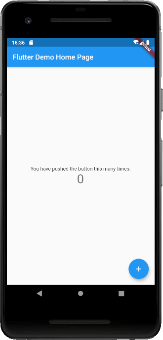
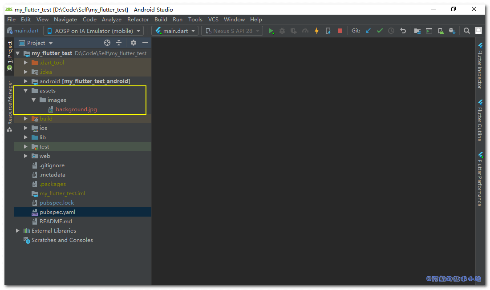

有时我们需要给APP的某个页面或某个widget添加背景图. 本篇文章就来记录下如何在Flutter中设置背景图片.

## 效果

有图有真相, 先来看下我们本篇博客将实现的最终效果:


速度快的同学直接看下面的核心代码!

## 实战开始

### 创建Flutter项目

创建一个新的Flutter项目, 运行查看一下:



空白的, 啥也木有.

### 添加图片资源

这里为大家提供一个好看的背景图:

<figure>


<figcaption>

**[Pexels](https://www.pexels.com/zh-cn/photo/2110951/?utm_content=attributionCopyText&utm_medium=referral&utm_source=pexels)** 上的 **[Emre Can](https://www.pexels.com/zh-cn/@emrecan?utm_content=attributionCopyText&utm_medium=referral&utm_source=pexels)** 拍摄的照片

</figcaption>

</figure>

下载此图片, 重命名为`background.jpg`. 我们来将其添加至Flutter项目中.

#### 创建资源目录

创建目录`./assets/images`, 将上面的图片放到该目录下:



#### 引入pubspec.yaml

进入`pubspec.yaml`, 将背景图片资源文件路径`assets/images/background.jpg`进行导入:

```
flutter:
  uses-material-design: true
  assets:
   - assets/images/background.jpg
```

\[epcl\_box type="notice"\]这里一定要注意缩进, 若格式有误将会出错!\[/epcl\_box\]

进行`package get`或在终端中输入:

```
flutter packages get
```

### 展示背景图

回到`./lib/main.dart`, 进行代码替换:

找到:

```
Center(
        child: Column(
          mainAxisAlignment: MainAxisAlignment.center,
          children: [
            Text(
              'You have pushed the button this many times:',
            ),
            Text(
              '$_counter',
              style: Theme.of(context).textTheme.headline4,
            ),
          ],
        ),
      )
```

替换为:

```
Container(
        decoration: BoxDecoration(
          image: DecorationImage(
            image: AssetImage("assets/images/background.jpg"),
            fit: BoxFit.cover,
          ),
        ),
        /*child替换为你自己的子widget*/
        child: null,
      )
```

### 大功告成

\[epcl\_box type="success"\]再次运行项目, 看看是不是成功了!\[/epcl\_box\]


## 核心代码

```
Container(
        decoration: BoxDecoration(
          image: DecorationImage(
            image: AssetImage("assets/images/background.jpg"),
            fit: BoxFit.cover,
          ),
        ),
        /*child替换为你自己的子widget*/
        child: null,
      ),
```

## 感谢

- [Pexels](https://www.pexels.com/zh-cn/photo/2110951/?utm_content=attributionCopyText&utm_medium=referral&utm_source=pexels) 上的 [Emre Can](https://www.pexels.com/zh-cn/@emrecan?utm_content=attributionCopyText&utm_medium=referral&utm_source=pexels) 拍摄的照片
- [Flutter SDK Set Background image - Stack Overflow](https://stackoverflow.com/questions/44179889/flutter-sdk-set-background-image)

## 结语

设置背景图其实并不复杂, 我们通过`Container`的`decoration`属性来控制了修饰的元素为图片. 相信各位可以举一反三.
