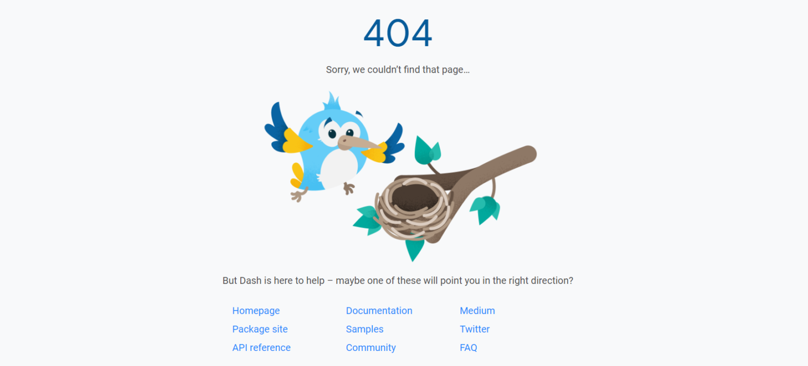

Flutter已经支持了Web端, 我们可以使用其创建动态网站了. Flutter能够处理来自Web的错误, 比如404未找到. 但是如何为Flutter应用创建自定义的404页面呢?

本文将介绍如何创建自定义页面, 用于用户在试图搜索不存在的页面时给用户友好提示.

## 在Flutter中将客户端重定向至自定义404页面

每个人在上网冲浪时都遇到过"404 Not Found"、"页面不存在"等等. Flutter通过自动将你重定向至初始路由来解决此问题(通常是APP首页). 观赏下一些大厂好看的404页面:

<figure>

<figcaption>

AirBnb(爱彼迎) 的404页面

</figcaption>

</figure>

<figure>

<figcaption>

Github 的 404页面

</figcaption>

</figure>

<figure>

<figcaption>

Flutter 的 404页面

</figcaption>

</figure>

如果你想拥有一个类似上方精美的404页面该怎么办? Flutter可以轻松做到这一点.

想创建自定义404错误页面, 你的APP需要使用`MaterialApp`, `CupertinoApp`或`WidgetsApp`小部件. 大多数APP也是使用它们三个之一. 它是创建Flutter APP时调用的第一个小部件.

MaterialApp通过以下顺序搜索路径来配置顶级导航器:

1. 对于`/`路由, 使用 [home](https://api.flutter.dev/flutter/material/MaterialApp/home.html) 属性(如果不是null).
2. 否则, 若 [routes](https://api.flutter.dev/flutter/material/MaterialApp/routes.html) 包含该路由, 则通过其处理.
3. 否则将会调用 [onGenerateRoute](https://api.flutter.dev/flutter/material/MaterialApp/onGenerateRoute.html) (如果提供). 对于任何未被 [home](https://api.flutter.dev/flutter/material/MaterialApp/home.html) 和 [routes](https://api.flutter.dev/flutter/material/MaterialApp/routes.html) 处理的有效路由, 它应返回非null值.
4. 最后, 若上述均未处理路由, 则会调用 [onUnknownRoute](https://api.flutter.dev/flutter/material/MaterialApp/onUnknownRoute.html) .

如果上述的方法均未处理路由, 将使用 [onUnknownRoute](https://api.flutter.dev/flutter/material/MaterialApp/onUnknownRoute.html) 来处理. 此函数通常用于异常处理. 比如此函数总是生成一个"404"页面, 该页面描述了未找到的路由. 不存在的404路由可能是APP的bug生成, 也有可能来自外部请求.

下面将演示如何为`onUnknownRoute`属性定义匿名函数, 该函数使用了一个`RouteFactory`函数. 它是一个工厂函数, 该函数传入一个`RouteSettings`函数类型并返回一个`Route`. 以下代码块将会展示定义`onUnknownRoute`属性有多简单:

    `onUnknownRoute: (settings) {   return MaterialPageRoute(builder: (_) => PageNotFound()); },`

`PageNotFound()`是一个窗口Widget, 也就是404页面. 用于解释发生了什么, 并提供重定向至首页的入口. 你可以自由发挥自己的创造力来创建该小部件!

## 结语

开发Flutter APP时, 异常处理相当重要. 使用`MaterialApp`, `CupertinoApp`或`WidgetApp`的`onUnknownRoute` 属性可以轻松处理网站中无法避免的404错误.

## 感谢

本篇文章翻译自[Jose Alba](https://medium.com/@josealba199675)的[Handling 404: Page not found error in Flutter](https://medium.com/flutter/handling-404-page-not-found-error-in-flutter-731f5a9fba29)
