不知道从哪个版本开始, Windows开始内置Linux系统了. 在之前的开发中, 两个系统切换超级麻烦, 不管是虚拟机、双系统还是双电脑, 极大的降低了开发速度, **并不符合程序员思维**. 所以只能舍弃其中一个. 然而大多数的软件开发环境还是Linux更舒适. 本篇文章就来记录下**如何开启Win10内置的Linux系统**.

## 需具备的条件

本篇文章的阿航的电脑系统及配置(配置略低, 莫笑😝😝):

<figure>

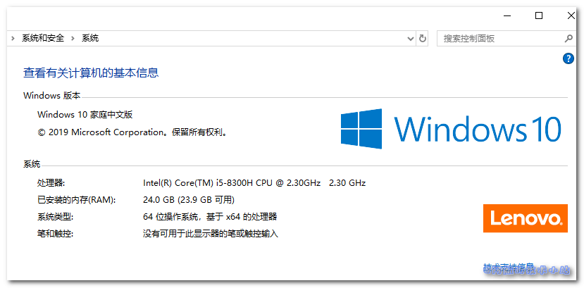

<figcaption>

电脑配置

</figcaption>

</figure>

<figure>

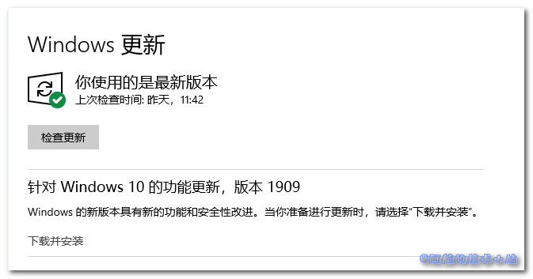

<figcaption>

Windows 10 版本

</figcaption>

</figure>

\[epcl\_box type="notice"\]注意对照系统版本, 若你的版本过旧, 可能无法顺利遵循本文章进行配置内置Linux系统.\[/epcl\_box\]

## 开始

### 开启开发者模式

点击开始, 输入`开发者设置`:

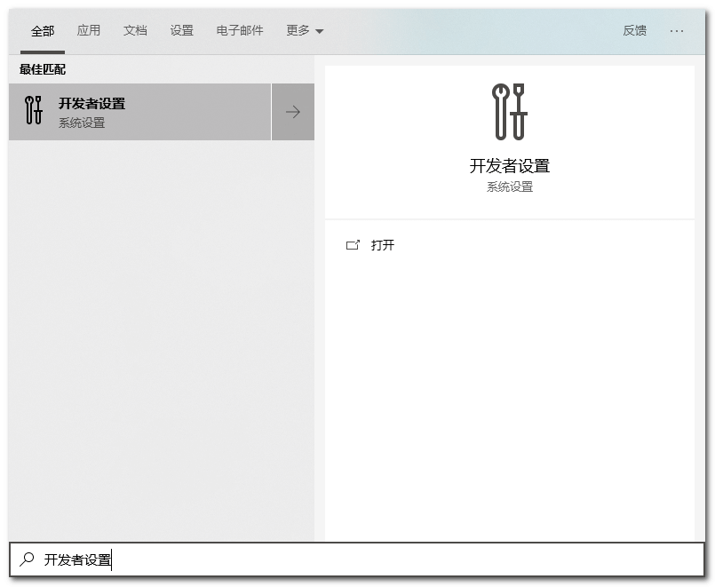

点击进入, 选中`开发人员模式`, 它会自动安装一些东西, 耐心等待完成:

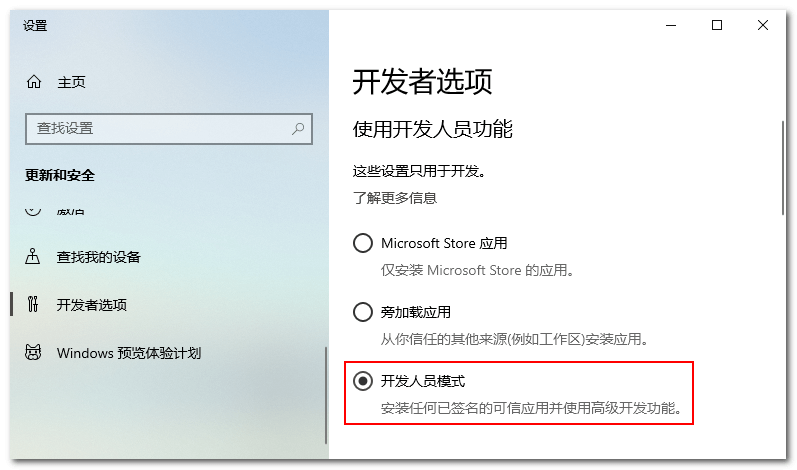

### 启用Linux子系统

点击开始, 输入`启用或关闭Windows功能`:

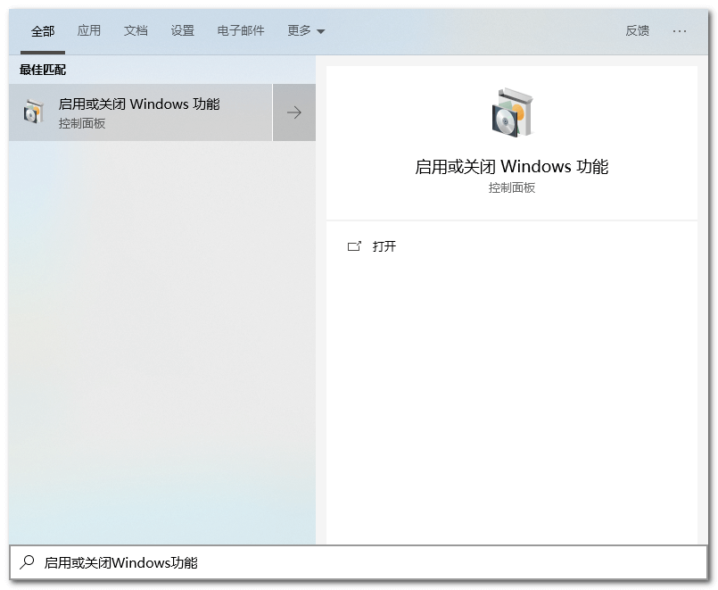

出现一个非常可爱的窗口, 向下拉, 找到`适用于 Linux 的 Windows 子系统`, 勾选, 确定:

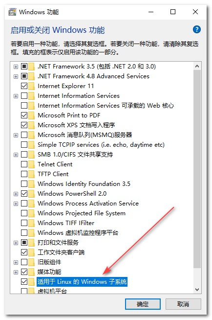

将会分别经过三个步骤:

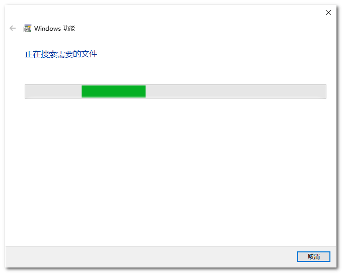

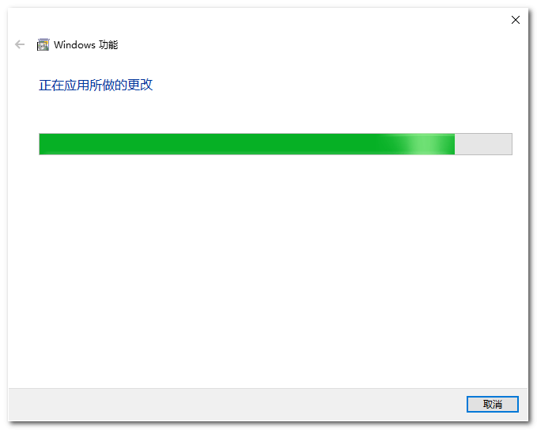

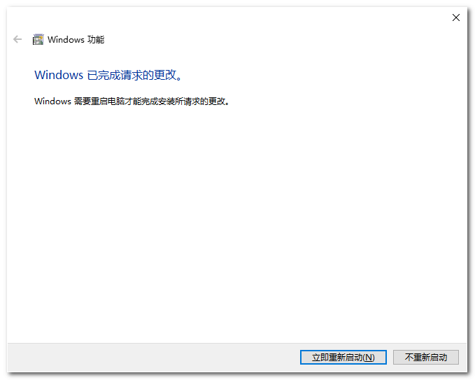

跟随引导, 点击"立即重新启动"(别忘了保存阿航的教程啊, 等下还要回来呢😄😄😄😄)

### 安装Ubuntu

开机后, 点击开始, 输入`Microsoft Store`, 点击进入.

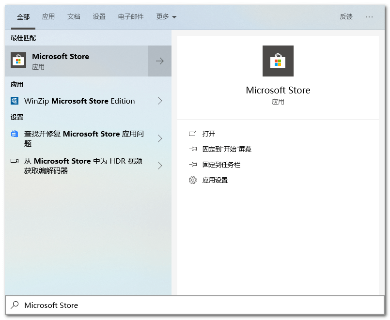

点击右上角"搜索", 输入`Ubuntu`, 可以搜索到如下结果:

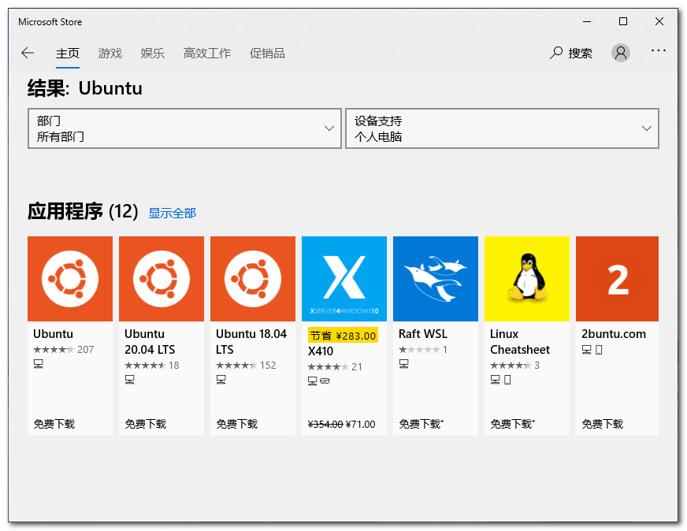

选择你需要的Ubuntu版本(如果不知道怎么选, 就直接选第一个`Ubuntu`), 点击进入详情页:

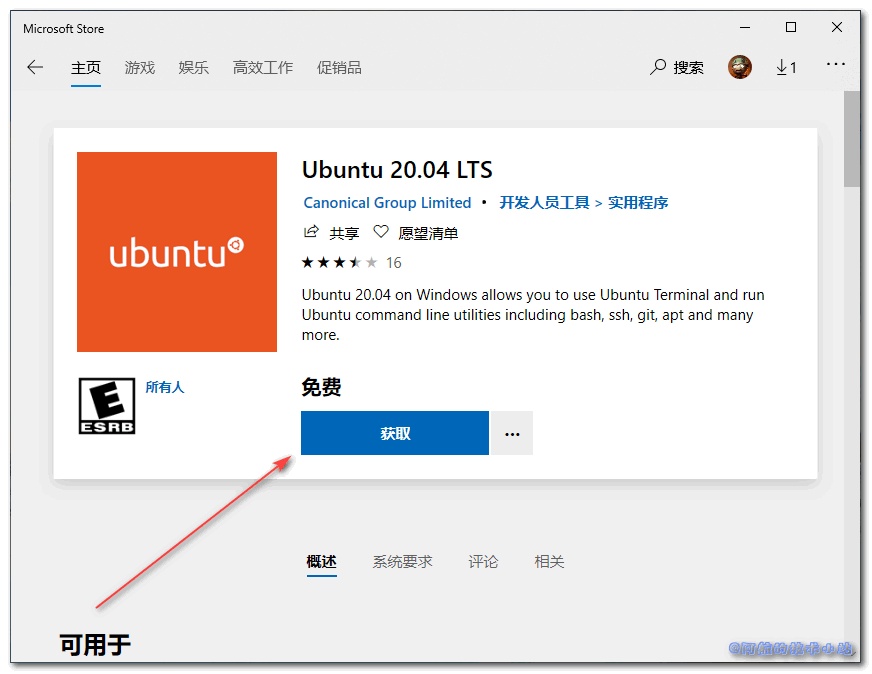

点击`获取`按钮.

* * *

#### 可能遇到的问题:

如果你遇到了`你所在的地区不支持通过 microsoft.com 购买的解决方案`, 可阅读[这篇文章](https://www.bugcatt.com/archives/1821):


如果你点击`获取`按钮没反应, 可阅读[这篇文章](https://www.bugcatt.com/archives/1831)解决.

* * *

获取中:


获取完成, 点击`安装`:

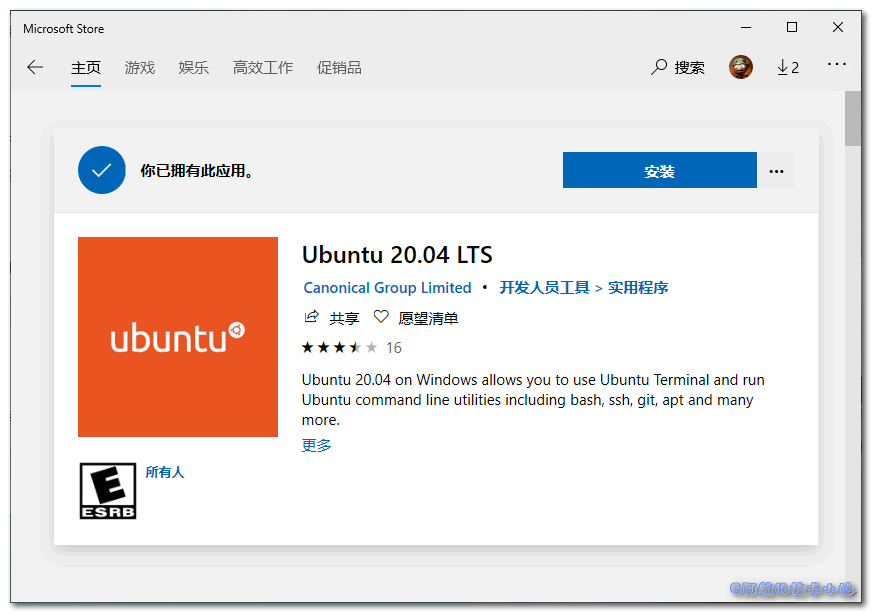

漫长的安装过程:

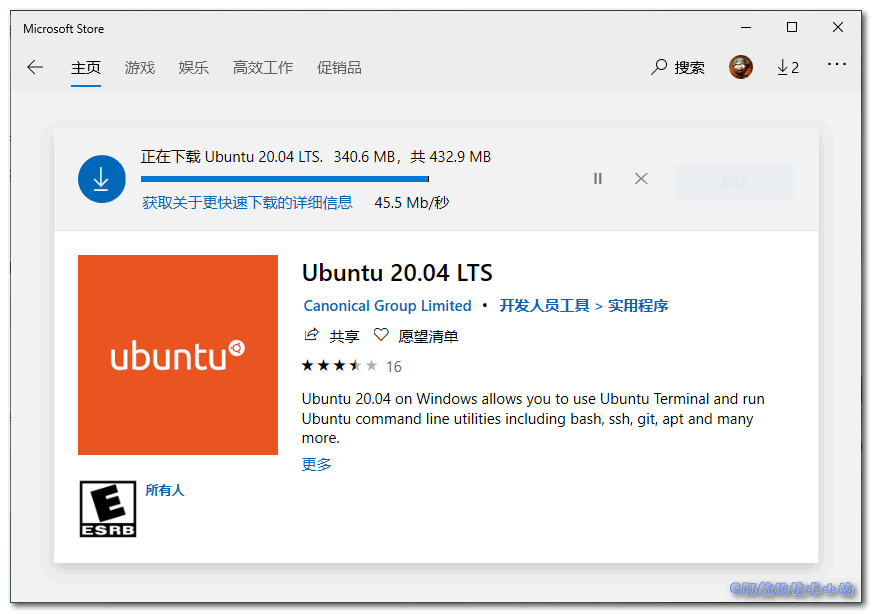

安装完成, 皆大欢喜. 点击`启动`:

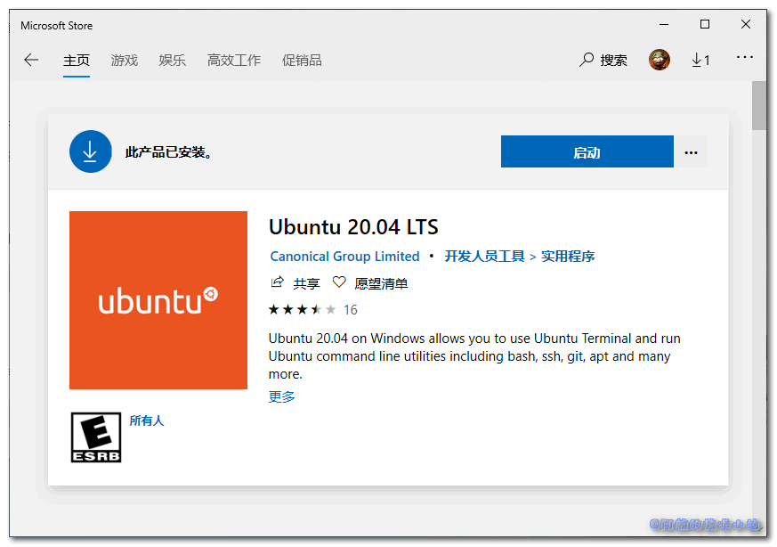

弹出对话框, 耐心等待安装过程:

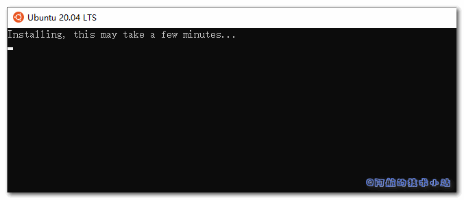

### 设置用户名及密码

依次填写 用户名(不能为root, 因为系统已有root账户):

```
Enter new UNIX username:
```

密码 (输入后不会显示在屏幕上):

```
New password:
```

确认密码 (同样, 输入后不会显示在屏幕上) :

```
Retype new password:
```

输入成功后, 就可以开始使用`Ubuntu`了:

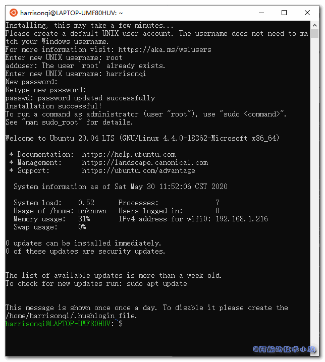

\[epcl\_box type="success"\]尽情享受你的新内置Ubuntu系统吧! 终于可以不用两个电脑来回换啦!😜😜😜\[/epcl\_box\]

## 感谢

[Install Ubuntu on Windows 10](https://ubuntu.com/tutorials/tutorial-ubuntu-on-windows)
