\[epcl\_box type="information"\]本片文章不仅适用于搜狗输入法，也同样支持很多主流输入法。\[/epcl\_box\]

## 引言

阿航最近购买了新的Macbook电脑。此前一直使用的是搜狗输入法，自然也在mac上安装了搜狗输入法Mac版。但是用了两天，发现**并不好用**。当把Mac自带的拼音输入法删除，替换为搜狗输入法时，偶尔会出现默认输入法变为了Abc输入法。导致快捷键紊乱。本篇文章就来记录下搜狗输入法转MacOS的拼音输入法。

## 确定目标

搜狗输入法上什么最值钱？是皮肤吗？唔。。我个人感觉花里胡哨的皮肤反而会降低效率。

**是词库、输入习惯、输入历史。**

所以我们要解决的是啥？那就是想方设法把搜狗输入法的词库以及输入历史导入到Mac拼音输入法中。

## 开始

### 深蓝词库

阿航在不断的摸索中，终于找到了这一款非常牛的开源项目。名叫深蓝词库。

👉 [Github仓库地址](https://github.com/studyzy/imewlconverter)

我们将会使用深蓝词库，将搜狗输入法的词库导出并转化为Mac拼音输入法的词库。

### 注意

因为深蓝词库的编写语言是C#。所以在Windows环境上操作将会减免许多麻烦。所以本片文章将会在Windows上进行操作。也强烈建议你使用Windows设备操作（没有Windows的话可以在Mac上运行虚拟机）。

### 下载深蓝词库

[点击此处](https://github.com/studyzy/imewlconverter/releases/tag/v2.9.0)跳转深蓝词库下载页，或者直接[点此下载2.9.0版本](https://github.com/studyzy/imewlconverter/releases/download/v2.9.0/imewlconverter_Windows.zip)。

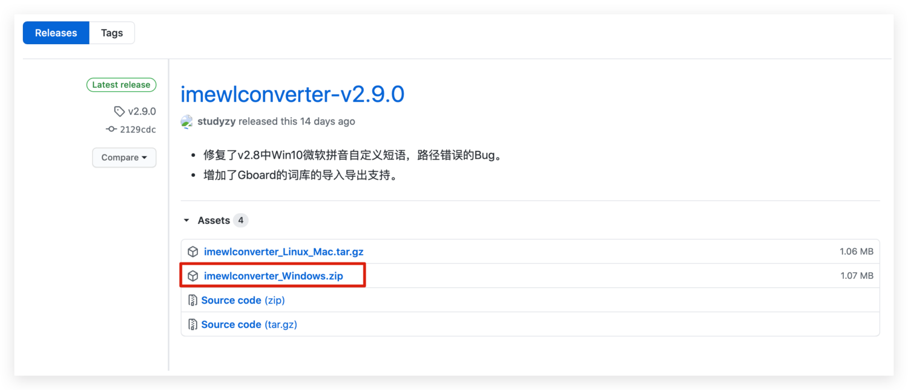

下载完成后，解压缩或直接双击`exe`文件：

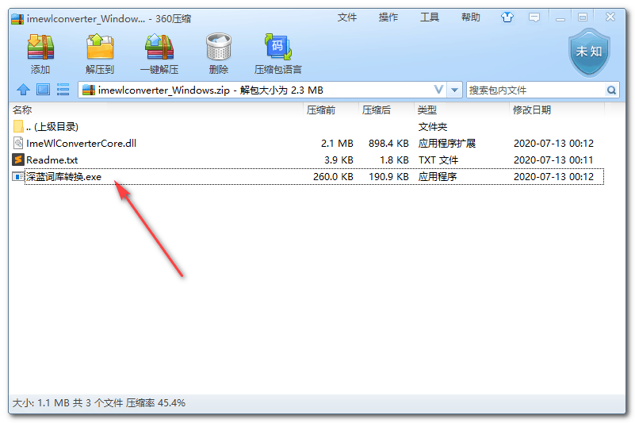

打开后看到一个非常简约的界面：

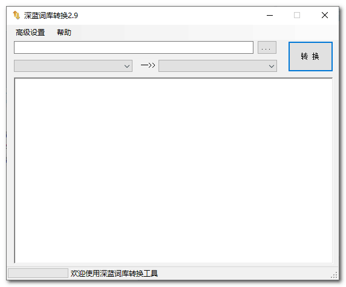

再放上简单使用说明：

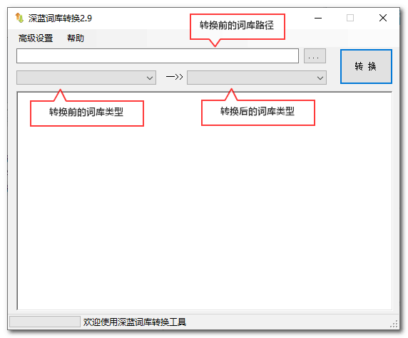

\[epcl\_box type="information"\]相信速度快的同学已经知道自己该怎么做了！\[/epcl\_box\]

### 导出原输入法词库

我们进入原输入法（这里以搜狗为例），右键输入法，点击属性设置：

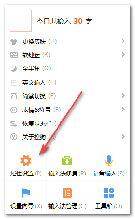

依次点击：词库 -> 中文用户词库下拉按钮 -> 导出/备份：

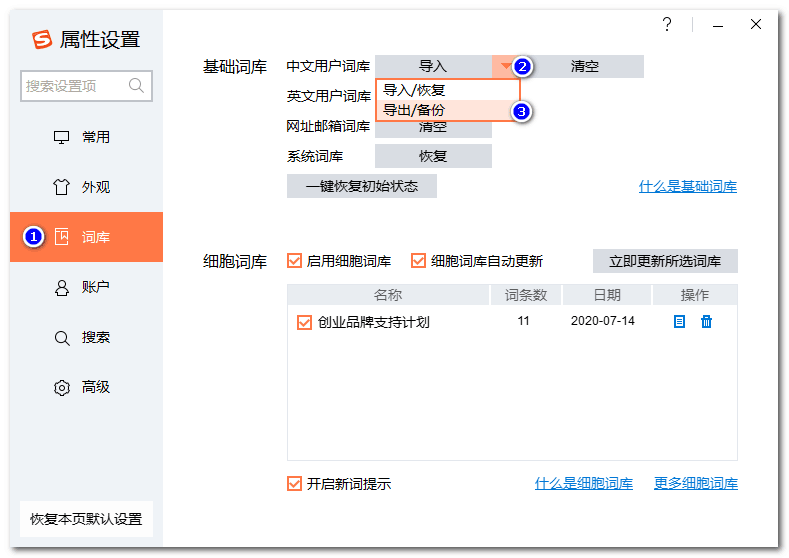

导出后应该会得到一个类似`搜狗词库备份_xx.bin`的文件。

### 使用深蓝词库转换

回到深蓝词库，将刚才导出的词库文件拖动进入深蓝词库窗口：

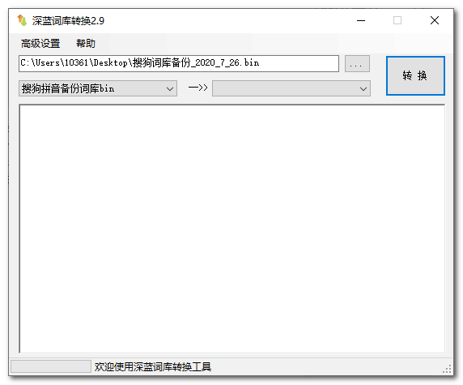

可以看到，原词库类型被自动选好。

紧接着，右边选择我们的目标输入法词库--Mac简体拼音：

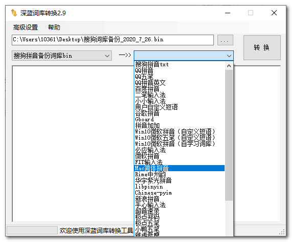

然后点击转换，观察左下角进度。耐心等待转换完成：

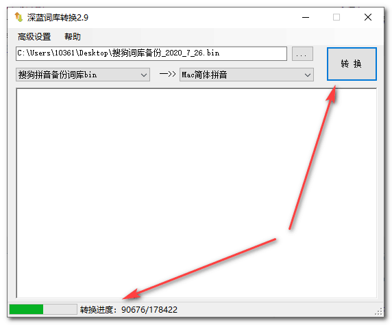

转换完成后，软件会提示你是否保存：

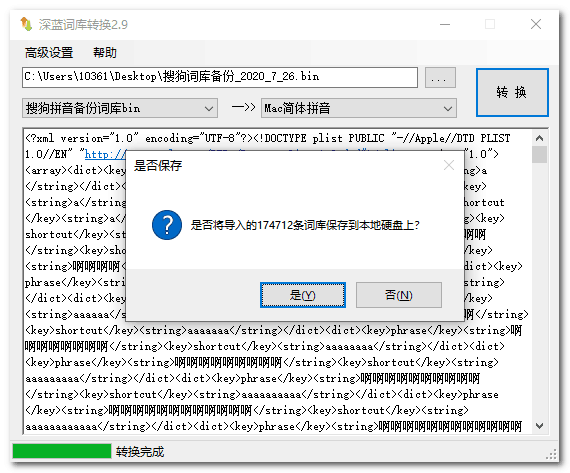

### 词库文件转移并重命名

把保存的文件传输到Mac上。

将导出的文件后缀名改为`.plist`。

### 打开Mac拼音设置

点击顶部拦的

然后选择「打开“简体拼音“偏好设置」

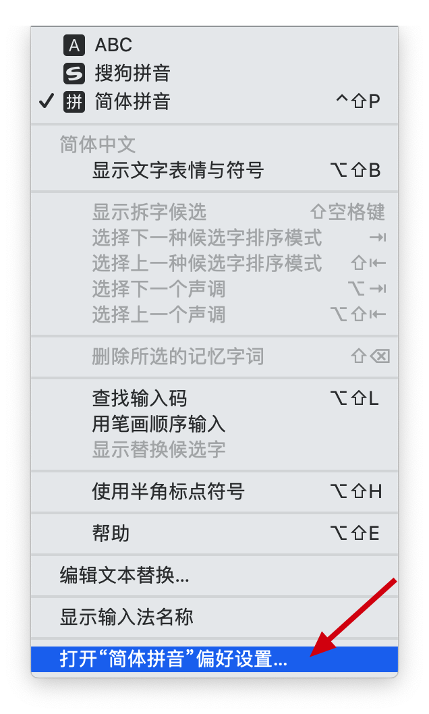

选择「文本」Tab：

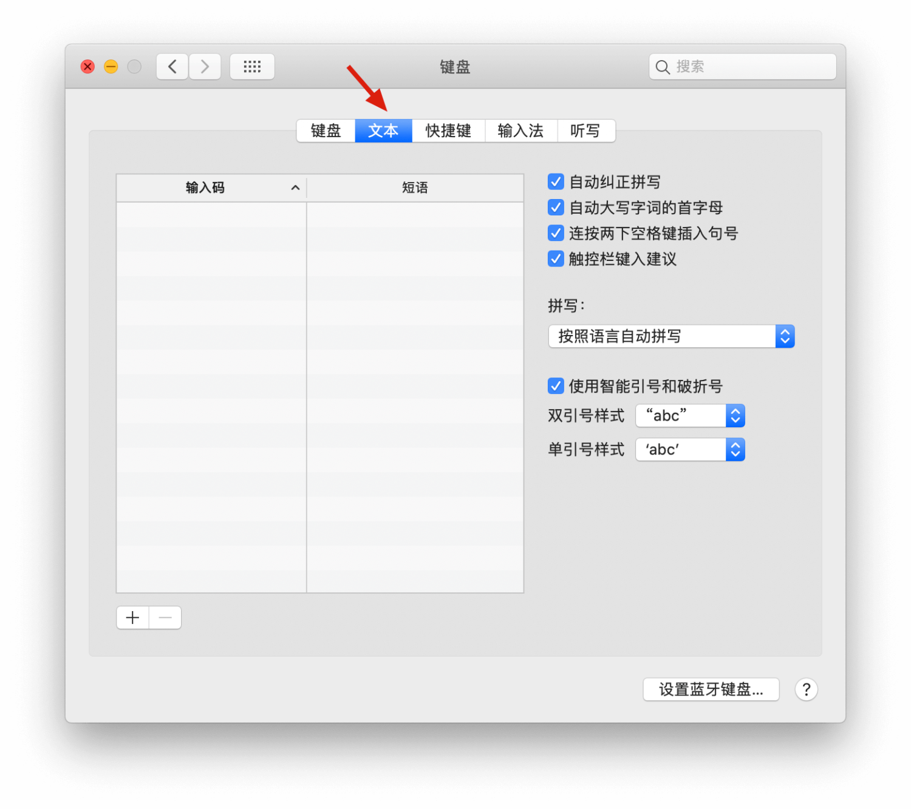

将你的词库文件拖动至「输入码」下面。

耐心等待一段时间。（如果你的词库大到十几M甚至几十M，那么请先干些别的。过程甚至可能超过一小时）

完成后，你的词库将会显示在此窗口上。至此，我们成功的把搜狗词库转入Mac词库。
