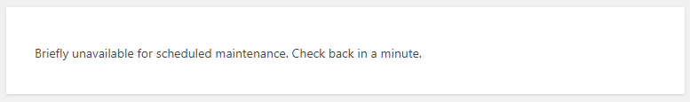
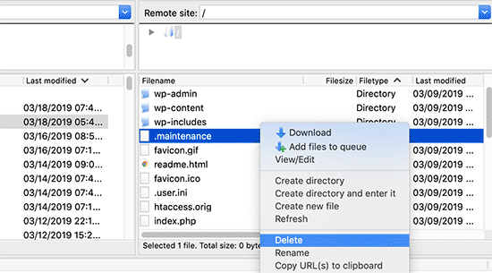

阿航在更新WordPress插件时, 插件更新失败并返回了504错误. 并且再次访问网站时, 网站提示`Briefly unavailable for scheduled maintenance. Check back in a minute.`好郁闷... 折腾了一下终于搞定. 本篇文章就来记录下如何解决该问题.

## 情景再现

先来看下阿航的报错, 是不是和你一样?

## 解决方案

### 方案一: 耐心等待

遇到此种情况, 最好的解决方案就是**等**. 因为WordPress在更新插件/主题时, 会暂停网站访问, 内部自动更新. 一般来讲, 耐心等待一段时间, 此报错就会自动解除.

如果等待无效, 请查看下面的方法.

### 方案二: 删除 .maintenance

在WordPress进行更新/维护时, 会在目录下创建一个 **.maintenance** 文件. 当更新/维护结束时, 会自动删除它.

所以我们只要手动删除即可解除更新/维护模式.

进入WordPress安装目录, 找到`.maintenance`文件, 删除即可:

再次刷新网站, 查看最终效果.

## 感谢

[wordpress更新出现Briefly unavailable for scheduled maintenance. Check back in a minute.](https://www.cnblogs.com/ytkah/p/11097523.html)
