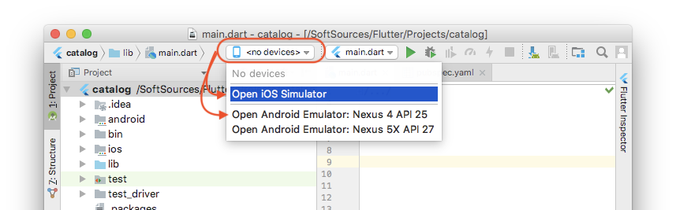

## 引言

今天在尝试启动flutter项目时碰到了这个问题：

    ` flutter run   No connected devices.`

本篇文章就来记录下解决方案。

## 解决方案

### 方案一：检查配置

flutter是个仍在成长的框架，可能出现一些难以排查的bug。如果你之前没有踩过这个坑，在某天突然碰到了，适合进行如下操作。

阿航解决疑难杂症的首选方式三部曲：

1. 运行`flutter doctor`，检查是否有出错的条目。
2. 运行`flutter clean`，清除掉缓存等文件。
3. 重启IDE（可以选择“清除缓存并重启”）。
4. 重启电脑。

### 方案二：

#### Android 真机

若要在Android设备上进行调试，Android设备版本需要在 4.1（API 16）以上。

在设备上启动开发人员选项和USB调试。具体步骤请自行百度。

用数据线连接手机和电脑，如果Android设备上出现提示，则授权计算机访问你的手机。

在终端中运行`flutter devices`命令以验证Flutter是否可以识别你连接的Android设备。

运行`flutter run`启动你的应用。

#### 安卓虚拟机

1. 在计算机上启动VM加速。
2. 启动Android Studio > Tools > Android > AVD Manager and select Create Virtual Device.
3. 选择要模拟的Android版本，然后下一步。
4. 选择你想模拟的一个或多个系统镜像，建议使用x86或x86\_64镜像
5. 在 Emulated Performance 选择 Hardware - GLES 2.0 以启动硬件加速。
6. 验证AVD配置是否正确，然后选择完成。

#### 连接设备

选择IOS或安卓设备：

