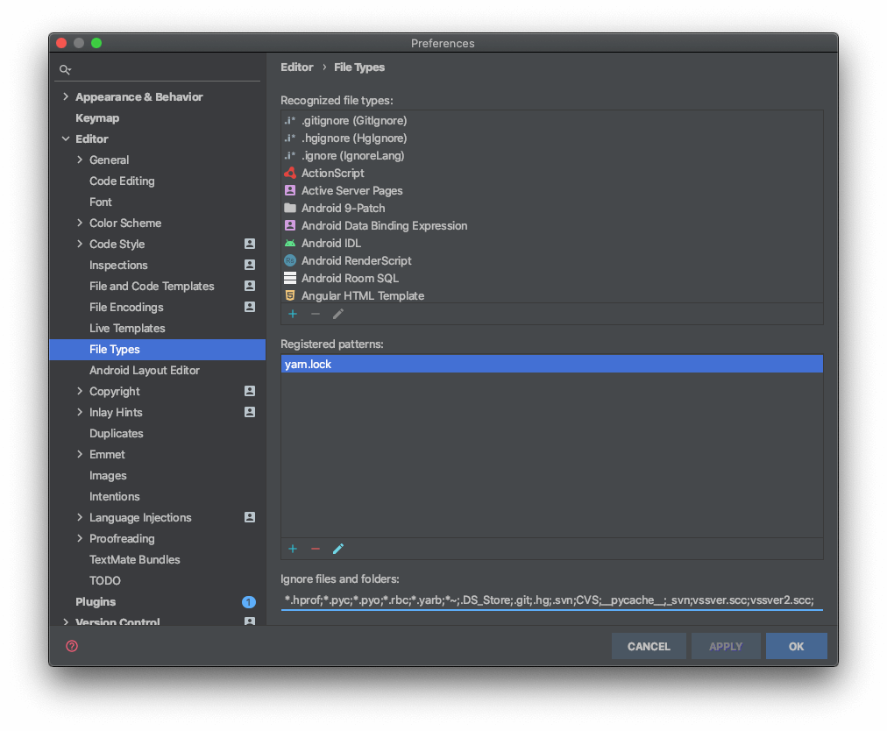

这回因为需要查看同事的前端React项目，所以从版本控制仓库下载后准备打开。使用的依旧是地表最强IDE，IntelliJ IDEA。 但是打开以后，进行`npm install`以后IDEA整个卡死了！本篇文章就来记录下如何解决IDEA打开Vue/React/Node项目卡顿卡死的问题。

## 问题原因

当然不是IDEA软件本身的问题（毕竟这软件这么贵），而是node项目会出现`node_modules`目录，放着前端项目使用的库。此目录相当庞大，所以如果不进行设置，会让IDEA累到不行，甚至“累死”。

## 解决方案

### 启动仍然卡死

如果你打不开项目了，并且每次打开都直接卡死，那么有两种方案：

1. 直接重命名你的项目，改名后，IDEA就找不到项目了。这样我们可以进行设置。
2. 删除项目目录的`.idea`目录。

### 设置忽略文件导入

打开设置

- Windows: `File` -> `Settings`

- Mac：左上角的`Intellij IDEA` -> `Preferences`

找到`Editor` -> `File Types`:

可以看到下方有一个输入框`Ignore files and folders`，在下面添加一条：

    `node_modules;`

点击保存。
