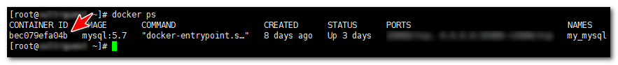

有时我们并没有配置某文件的映射关系, 当需要调整时, 就需要将文件进行复制. 所以本篇文章来记录下如何在docker容器和宿主机直接传输文件.

## 开始

首先来确认下你的容器ID:

    `docker ps`
    

拿到需要传输文件的容器ID(示例中是`bec079`):



### 宿主机向容器传输文件

先来看下把宿主机的文件传入容器的命令:

```
docker cp 宿主机文件路径 容器ID:容器内目录路径
```

例如:

    `docker cp /usr/local/bin/mysql.cnf bec079:/etc/mysql/`
    

### 容器向宿主机传输文件

类似的, 只需要将公式交换即可:

```
docker cp 容器ID:容器内文件路径 宿主机目录路径
```

例如:

    `docker cp bec079:/etc/mysql/mysql.cnf /usr/local/bin/`
    

## 搞定!
