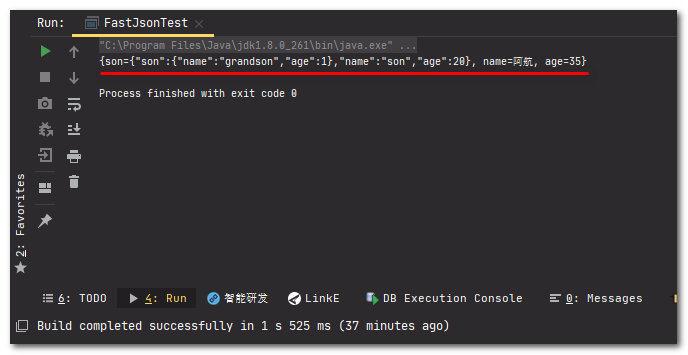

本次开发的任务是比对两个对象的属性, 查看有哪些地方不一致. 为了长期考虑, 决定将它们分别转为Map对象, 再遍历该Map, 分别比较键值对来达到效果. 本篇文章记录下如何通过FastJson将对象Object转为Map.

## 开始

### 引入FastJson

将`version`替换为合适的版本.

    `<dependency>     <groupId>com.alibaba</groupId>     <artifactId>fastjson</artifactId>     <version>1.2.69</version> </dependency>`

### 对象转map函数

    `/**  * 对象转Map  * @param object 要转换的对象  * @return 转换后的Map  */ private Map<String, Object> object2Map(Object object) {     JSONObject jsonObject = (JSONObject) JSON.toJSON(object);     Set<Map.Entry<String, Object>> entrySet = jsonObject.entrySet();     Map<String, Object> map = new HashMap<>();     for (Map.Entry<String, Object> entry : entrySet) {         map.put(entry.getKey(), entry.getValue());     }     return map; }`

### 函数 + 运行测试

    `import com.alibaba.fastjson.JSON; import com.alibaba.fastjson.JSONObject;  import java.util.HashMap; import java.util.Map; import java.util.Set;  public class FastJsonTest {      public static void main(String[] args) {         // 创建对象         Person person = new Person();         person.setName("阿航");         person.setAge(18);         // 转换为Map         Map<String, Object> map = new FastJsonTest().object2Map(person);         // 打印         System.out.println(map.toString());     }      private Map<String, Object> object2Map(Object object) {         JSONObject jsonObject = (JSONObject) JSON.toJSON(object);         Set<Map.Entry<String, Object>> entrySet = jsonObject.entrySet();         Map<String, Object> map = new HashMap<>();         for (Map.Entry<String, Object> entry : entrySet) {             map.put(entry.getKey(), entry.getValue());         }         return map;     }      private static class Person {         private String name;         private Integer age;          public String getName() {             return name;         }          public void setName(String name) {             this.name = name;         }          public Integer getAge() {             return age;         }          public void setAge(Integer age) {             this.age = age;         }     } }`

运行后打印到控制台:

### 复杂对象转换

> 此函数也可以转换嵌套对象, 比如`Person`拥有子对象:

    `import com.alibaba.fastjson.JSON; import com.alibaba.fastjson.JSONObject;  import java.util.HashMap; import java.util.Map; import java.util.Set;  public class FastJsonTest {     public static void main(String[] args) {         // 创建嵌套对象         Person grandson = new Person();         grandson.setName("grandson");         grandson.setAge(1);          Person son = new Person();         son.setName("son");         son.setAge(20);         son.setSon(grandson);          Person person = new Person();         person.setName("阿航");         person.setAge(35);         person.setSon(son);         // 对象转换为Map         Map<String, Object> map = new FastJsonTest().object2Map(person);         System.out.println(map.toString());     }      /**      * 对象转Map      * @param object 要转换的对象      * @return 转换后的Map      */     private Map<String, Object> object2Map(Object object) {         JSONObject jsonObject = (JSONObject) JSON.toJSON(object);         Set<Map.Entry<String, Object>> entrySet = jsonObject.entrySet();         Map<String, Object> map = new HashMap<>();         for (Map.Entry<String, Object> entry : entrySet) {             map.put(entry.getKey(), entry.getValue());         }         return map;     }      private static class Person {         private String name;         private Integer age;         private Person son;          public String getName() {             return name;         }          public void setName(String name) {             this.name = name;         }          public Integer getAge() {             return age;         }          public void setAge(Integer age) {             this.age = age;         }          public Person getSon() {             return son;         }          public void setSon(Person son) {             this.son = son;         }     } }`

运行后打印到控制台, 可以看到, 这个复杂的嵌套对象也被正常打印:

## 感谢

[借助fastjson 实体对象转map](https://www.cnblogs.com/lijiale/p/5417597.html)
